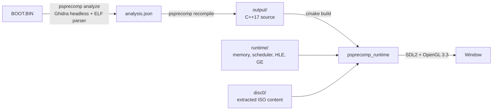
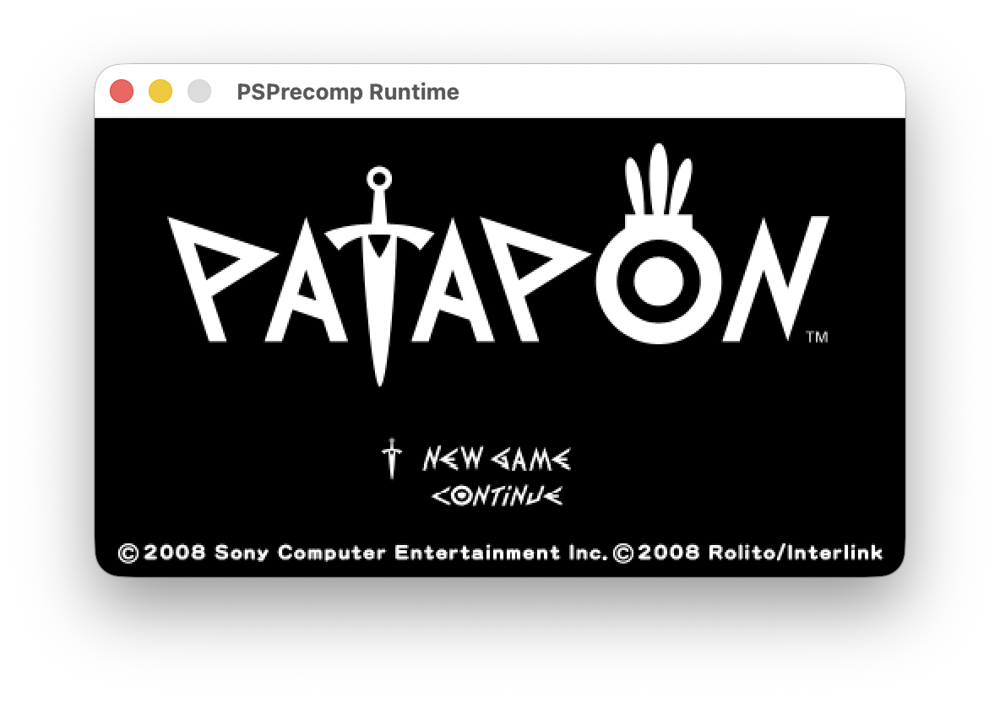

# psprecomp

A PSP static recompiler: a Rust pipeline translates Allegrex MIPS32 binaries into C++17 source,
and a C++17 runtime (SDL2 + OpenGL 3.3) executes the result with HLE implementations of the PSP
OS services. The target binary is **Patapon (USA) BOOT.BIN**.

> [!WARNING]
> **One game only.** This project has been developed and verified against exactly one binary —
> Patapon (USA). HLE semantics, renderer fallbacks, and asset handling may be specific to it;
> other PSP games will most likely not work without additional effort.
>
> **Vibe coded.** The codebase is largely AI-generated (Claude). Every change is verified by
> running the game and diffing behavior against PPSSPP, but the code has not had a traditional
> human review pass — expect rough edges.

See [ARCHITECTURE.md](ARCHITECTURE.md) for the structural reference (crates, runtime subsystems,
data flow, invariants), and [docs/GRAPHICS.md](docs/GRAPHICS.md) for how the runtime translates
the PSP Graphics Engine to OpenGL 3.3.

## Table of Contents

- [Overview](#overview)
- [Pipeline](#pipeline)
- [Current Status](#current-status)
- [Building and Running](#building-and-running)
- [Verification Methodology](#verification-methodology)
- [Limitations](#limitations)
- [Reference Projects](#reference-projects)
- [License](#license)

## Overview

The recompiler works in two stages. `psprecomp analyze` runs Ghidra headless analysis on the PSP
ELF and merges it with a Rust ELF parser into `analysis.json` (functions, imports, relocations,
mid-function entry points, xrefs, data sections). `psprecomp recompile` decodes every instruction
into a typed IR and emits C++17: one C++ function per guest function, an address-to-function
dispatch table, and the data sections. The generated code compiles together with the runtime in
`runtime/`, which provides guest memory, a cooperative thread scheduler, HLE stubs for the
imported firmware NIDs, and a PSP Graphics Engine (GE) to OpenGL 3.3 translation layer.

For Patapon BOOT.BIN the current pipeline recompiles ~14,104 functions with 2,022 mid-function
entry points and HLEs 237 imported firmware NIDs.

## Pipeline



## Current Status

**As of 2026-06-10: the game boots and renders the PATAPON title screen** — logo, NEW
GAME/CONTINUE menu, and copyright text, visually matching PPSSPP. This is the first real graphics
the runtime has displayed; earlier rendering milestones were measured in display-list metrics
only.



Recent work that got it there (merged via PR #17):

- **Faithful IO HLE** — PPSSPP-exact rejection of NULL/empty `sceIoOpen` paths, a file-descriptor
  cap, and `BADF` errors; fixed a leak of ~159,000 fds during boot.
- **Emitter fix** — the FPU integer and float register views (`f[]`/`fi[]`) now alias via an
  anonymous union; previously every `lwc1`-fed float computation in the binary was a no-op.
- **GE SIGNAL flow control** — display-list JUMP/CALL/RET behaviors (0x10–0x12); Patapon keeps
  all real geometry in SIGNAL-called sub-lists, all of which were previously skipped.
- **Renderer fixes** — CLUT palette addressing (palettes were read from zeroed RAM, making all
  texels transparent) and column-major PSP matrix layout in the vertex transform (vertices
  previously collapsed to a point).

## Building and Running

### Prerequisites (macOS / Homebrew)

```bash
brew install cmake sdl2 pkg-config ghidra
```

Rust (stable), CMake 3.16+, SDL2 (found via pkg-config), a C++17 compiler, OpenGL 3.3, and
Ghidra 12.0.2 (analyze step only). You also need Patapon's BOOT.BIN and the extracted ISO
content (`disc0/`).

### Full pipeline

```bash
# 1. Rust pipeline
cargo build --release
cargo test

# 2. Analyze the binary (requires Ghidra)
cargo run --release -- analyze --ghidra-dir <ghidra-install>/libexec  # e.g. $(brew --prefix ghidra)/libexec on macOS BOOT.BIN

# 3. Generate C++ source (PSPRECOMP_CROSS_MID=1 is required)
PSPRECOMP_CROSS_MID=1 cargo run --release -- recompile analysis.json -o output

# 4. Build the runtime
cmake -B runtime/build -S runtime && cmake --build runtime/build -j$(sysctl -n hw.ncpu)

# 5. Run (the configuration the current status was verified under)
PSPRECOMP_CROSS_MID=1 PSPRECOMP_CLEANROOM=1 ./runtime/build/psprecomp_runtime
```

Useful environment variables:

| Variable | Effect |
|----------|--------|
| `PSPRECOMP_CROSS_MID=1` | Cross-function mid-jump support; set at both recompile and run in the standard workflow |
| `PSPRECOMP_CLEANROOM=1` | Faithful HLE pass-throughs instead of legacy debug wrappers; the standard verification configuration |
| `PSPRECOMP_DISC0=/path` | Extracted ISO content directory (default `./disc0`) |
| `PSPRECOMP_STRICT=1` | Abort on dispatch-table miss (debugging) |

Inspect the emitted C++ for a single function:

```bash
cargo run --release -- dump analysis.json 0xADDRESS
```

## Verification Methodology

PPSSPP is used as a scriptable behavioral oracle (breakpoints, memory reads, and input injection
through its debugger API) to capture ground truth and find the first divergence from our runtime.
The runtime exposes a TCP debug socket on port 9999 for live memory inspection, and changes are
checked with adversarial sub-agent verification before they are banked.

## Limitations

- **Temporary renderer fallbacks.** A known open guest-side bug remains: recompiled FPU/VFPU code
  computes broken view/projection matrices (all-zero view, NaN projection). Two renderer
  fallbacks compensate — all-zero view is treated as identity, and a degenerate projection falls
  back to a Patapon-specific ortho. This is adequate for the 2D title/menu screens but must be
  fixed before 3D gameplay: the fallback hardcodes Patapon's viewport and has no depth ordering.
- **No audio.** ATRAC and SAS are crude stubs (0 samples decoded, instant end-of-stream).
- **GE gaps.** SIGNAL relative/offset variants (0x13–0x18), lighting, texture matrix, bone/morph
  skinning, bezier surfaces, and block transfers (TRANSFERSTART) are unimplemented.
- **Beyond the title screen is unexplored.** Title-screen interactivity (menu input advancing the
  game's state machine) has not yet been exercised in our runtime.
- **A rare race** in the game's IO worker (a phantom job, roughly 1 in 20 boots) is tripwired but
  not fixed.
- **Single target, single platform.** Developed and tested against Patapon BOOT.BIN only — other
  PSP games will most likely not work (see the warning at the top). Developed and tested on
  macOS only; Linux and Windows have never been tried (the build assumes SDL2 via pkg-config and
  OpenGL 3.3, and the render-queue threading model was designed around macOS constraints).
  Testing and supporting other operating systems is a to-do. Optimizer passes are disabled by
  design until a later phase.

## Reference Projects

- [N64Recomp](https://github.com/N64Recomp/N64Recomp) — N64 static recompiler with a similar
  dispatch-table/context-struct architecture
- [PPSSPP](https://github.com/hrydgard/ppsspp) — PSP emulator, used as a behavioral oracle
  (observable behavior only)

## License

GPL-2.0-or-later. See [LICENSE](LICENSE).

Portions of the runtime (VFPU register-file semantics, GE command constants, HLE error codes
and kernel-object semantics) are derived from [PPSSPP](https://github.com/hrydgard/ppsspp),
which is licensed GPL-2.0-or-later.

Bundled third-party loaders (`runtime/src/glad.c`, `runtime/include/glad/`,
`runtime/include/KHR/khrplatform.h`) carry their own permissive licenses, noted in their
file headers.
