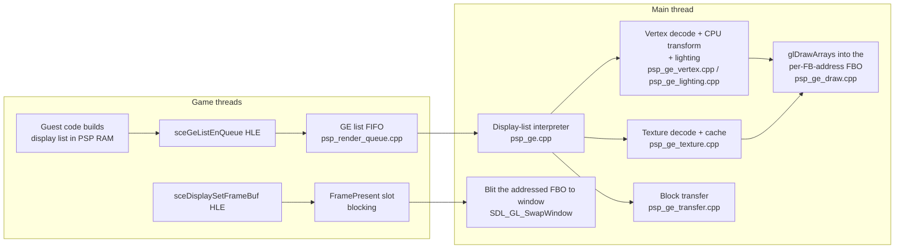

# Graphics: PSP GE to OpenGL 3.3

How the runtime translates the PSP Graphics Engine (GE) into OpenGL 3.3 under SDL2. This is a
deep-dive companion to [ARCHITECTURE.md](../ARCHITECTURE.md); everything described here is the
behavior of the code as written, including its approximations and known gaps.

## Contents

- [Overview](#overview)
- [Display-List Interpretation](#display-list-interpretation)
- [Vertex Pipeline](#vertex-pipeline)
- [Texture Pipeline](#texture-pipeline)
- [Raster State Mapping](#raster-state-mapping)
- [Threading and Present](#threading-and-present)
- [What Is Not Implemented](#what-is-not-implemented)
- [Debugging Hooks](#debugging-hooks)

## Overview

The PSP's GE is a command-stream GPU: the game writes a *display list* (a sequence of 32-bit
command words) into PSP RAM and submits it with `sceGeListEnQueue`. The runtime replaces the
hardware with a software interpreter (`runtime/src/psp_ge.cpp`) that walks the list on the main
thread, tracks GE register state, and turns `PRIM` commands into `glDrawArrays` calls into a small
pool of 480x272 offscreen FBOs. Vertex transform and per-vertex lighting happen entirely on the
CPU; the GL shader is a fixed pass-through "uber-shader". There is one FBO per distinct guest
framebuffer address the GE renders into (up to `GE_MAX_TARGETS`), keyed by that address (see
[Render targets and render-to-texture](#render-targets-and-render-to-texture)). Presenting a frame
blits the FBO for the address the game is scanning out to the window and swaps.

Key files:

| File | Role |
|------|------|
| `runtime/src/psp_ge.cpp` | Display-list interpreter and `GeState` state machine |
| `runtime/src/psp_ge_vertex.cpp` | Vertex format decode, CPU transform, range cull, rectangle expansion |
| `runtime/src/psp_ge_lighting.cpp` | Per-vertex GE lighting (pure CPU) |
| `runtime/src/psp_ge_texture.cpp` | Texture cache keyed by address + content; binds GL textures |
| `runtime/src/psp_ge_texdecode.cpp` | Pure texture/CLUT decode (stride, swizzle, palette) |
| `runtime/src/psp_ge_transfer.cpp` | GE block-transfer (`TRANSFERSTART`) guest-memory copies |
| `runtime/src/psp_ge_viewport.cpp` | PSP viewport/depth registers -> GL viewport/depth range |
| `runtime/src/psp_ge_draw.cpp` | Per-address FBO pool, VBO upload, GL state mapping, draw, present |
| `runtime/src/psp_ge_shader.cpp` | The single GLSL 330 shader pair |
| `runtime/src/psp_render_queue.cpp` | Cross-thread queue; the only path to GL |
| `runtime/src/hle/psp_hle_ge.cpp` | `sceGe*` HLE entry points |
| `runtime/src/hle/psp_hle_display.cpp` | `sceDisplay*` HLE entry points |
| `runtime/include/psp_ge_constants.h` | Command IDs, VTYPE fields, format enums (derived from PPSSPP) |
| `runtime/include/psp_ge_blend.h` | PSP blend factor/equation -> GL blend mapping (pure) |
| `runtime/include/psp_ge_mask.h` | `MASKRGB`/`MASKALPHA` -> per-channel color write enables (pure) |

## Display-List Interpretation

### Command format

Each display-list word is `[31:24] = command, [23:0] = data`. Float-valued commands (matrices,
viewport, texture scale) encode the *upper 24 bits* of an IEEE 754 float; the interpreter
reconstructs the value as `data << 8` reinterpreted as float (`data_to_float`).

`ge_process_display_list(rdram, list_addr, stall_addr)` is a fetch/decode/execute loop over a
single `GeState` instance (a global; there is one GE, mirroring the hardware). Most commands
just store their data into a `GeState` field — addresses, the VTYPE bitfield, matrices, texture
registers, enables, blend/depth/cull words. The interesting ones are below. A safety valve
(`GE_MAX_COMMANDS` = 4M commands) stops runaway lists, and unknown commands warn once per
command ID (`cmd_warned[256]`).

### Addressing

`BASE` (0x10) stores its raw 24-bit data word. 24-bit address fields in `VADDR`, `IADDR`,
`JUMP`, `CALL` and `BJUMP` are resolved by `ge_relative_address` (`include/psp_ge.h`): the
command's low 24 bits are combined with BASE bits 16–19 as address bits 24–27, then the current
`offset_addr` is added, wrapped to 28 bits. `OFFSETADDR` (`offset_addr = data << 8`) and `ORIGIN`
(`offset_addr = pc`) set that offset, which is saved and restored across CALL/RET.

### Flow control

- **JUMP** (0x08): `pc = resolve_addr(data & 0x00FFFFFC)`.
- **CALL** (0x0A): pushes `{return pc, offset_addr, base_addr}` onto a 32-entry call stack
  (`GE_CALL_STACK_SIZE`), then jumps. Overflow stops processing and parks the list as stalled
  (it stays in the queue and never completes).
- **RET** (0x0B): pops and restores `offset_addr`/`base_addr`. Underflow parks the list as
  stalled, like CALL overflow.
- **BJUMP** (0x09, bounding-box conditional jump): treated as a no-op — the jump is never
  taken, so everything is conservatively processed.
- **END** (0x0C): terminates the list, returns `completed = true`, and marks the front buffer
  dirty (`ge_draw_end_list`). It does **not** present: presentation is driven by the guest's
  `sceDisplaySetFrameBuf` page-flip, with `ge_draw_present_if_stale` as a no-flip safety net
  (issue #59). The per-END auto-present was removed because it published intermediate buffers
  (e.g. a trailing clear) as if they were frames.
- **FINISH** (0x0F): does *not* end the list. It fires the registered GE finish callback (from
  `sceGeSetCallback`) synchronously: the handler is resolved with `RECOMP_LOOKUP` and invoked
  with `a0 = data & 0xFFFF` (the token the game embedded in the list), `a1 = finish_arg`, and
  `sp` pointing at a lazily-carved 4 KB guest stack — GE callbacks run real recompiled guest
  code that pushes stack frames, so a zero `sp` would corrupt low memory.

### SIGNAL (0x0E) — including flow-control behaviors

`SIGNAL`'s data is `[23:16] = behavior, [15:0] = signal value`. Behaviors 0x10–0x12 are GE
*flow control*, matching PPSSPP's `GPUCommon::ProcessSignal`:

- **0x10 JUMP / 0x11 CALL**: the SIGNAL pairs with the *following* `END` word. The 32-bit
  target is `(signal_value << 16) | (END data & 0xFFFF)`, masked with `0xFFFFFFFC` (bits 28–31
  are kept so uncached-space PCs still compare correctly against the stall address). The paired
  END is consumed — it is **not** a list end. CALL pushes onto the same call stack as
  `GE_CMD_CALL`; on stack overflow the call is skipped (PPSSPP parity) rather than parking the
  list.
- **0x12 RET**: pops the call stack; with an empty stack it skips the paired END and continues.

This matters for Patapon specifically: the game keeps essentially all real geometry in
SIGNAL-called sub-lists. Before these behaviors were implemented, every sub-list was skipped
and the title screen was empty.

Any other behavior falls through to the *user signal callback* path: the handler registered by
`sceGeSetCallback` is invoked like the FINISH callback (`a0 = data & 0xFFFF`,
`a1 = signal_arg`, carved guest stack). The suspend/continue behavior distinctions (0x01–0x03)
and the relative/offset flow-control variants (0x13–0x18) are not implemented.

### Stall address and list lifecycle

The stall address implements the PSP's producer/consumer protocol: the game enqueues a list
whose tail it is still writing, with `stall_addr` marking the write frontier. Before each
fetch, the interpreter checks `pc >= stall_addr` (when `stall_addr != 0`) and, if hit, returns
a *stalled* result with the current PC. The list stays in the queue; when the game calls
`sceGeListUpdateStallAddr`, the queue entry's stall address is advanced, the `stalled` flag is
cleared, and processing later resumes from the saved PC.

### List enqueue from HLE

`hle_sceGeListEnQueue` (`runtime/src/hle/psp_hle_ge.cpp`) pushes
`{uid, list_addr, stall_addr, current_pc}` onto the GE FIFO and returns the UID immediately —
the game thread does not wait for rendering. UIDs are 1-based because PPSSPP returns 1-based GE
list IDs and the game passes the UID back to `UpdateStallAddr` (a 0 UID caused mismatches).
`sceGeListEnQueueHead` is treated identically (no priority semantics). `sceGeDrawSync` and
`sceGeListSync` both map to `render_queue_draw_sync` (per-list sync is not tracked):
mode 0 blocks until the FIFO drains, with a 500 ms timeout safety valve against lost lists;
mode 1 polls. `sceGeSetCallback` reads the 4-word `sceGeCallbackData` struct from guest memory,
registers the signal/finish handlers, and also calls the guest's
`sceKernelRegisterSubIntrHandler`/`EnableSubIntr` shims so the observable boot sequence stays
in lock-step with PPSSPP. `sceGeEdramGetAddr`/`GetSize` return `0x04000000` / 2 MB.

## Vertex Pipeline

### Vertex formats

`GE_CMD_VERTEXTYPE` stores the raw VTYPE bitfield; `psp_ge_vertex.cpp` decodes all of it:

| Component | Widths | Normalization |
|-----------|--------|---------------|
| Texcoord (TC) | u8, s16, float | u8 / 128, s16 / 32768, float as-is |
| Color (COL) | 565, 5551, 4444, 8888 | expanded to RGBA8 (5551 alpha is 0 or 255) |
| Normal (NRM) | s8, s16, float | s8 / 127, s16 / 32767 |
| Position (POS) | s8, s16, float | raw values (no scaling) |
| Index (IDX) | u8, u16, u32 | read from `IADDR` |
| Weights | u8, u16, float, count 1–8 | **stride accounted for, data skipped** (no skinning) |

`ge_vertex_stride` reproduces the PSP's packing rules, including alignment: 16-bit components
align the running offset to 2, float components to 4, and the total stride is padded to the
alignment of the largest component. Indexed draws read the index buffer first and then address
`vertex_addr + index * stride`; non-indexed draws are sequential.

### Through mode vs. transform mode

Bit 23 of VTYPE selects *through mode* (pre-transformed screen coordinates). Through-mode
vertices are mapped directly to NDC for the 480x272 screen:
`x/240 - 1`, `1 - y/136`, `z/65535`, with `w = 1`. Their texcoords arrive in texel units and are
normalized to `[0,1]` by dividing by the texture dimensions from `TEXSIZE0` (PPSSPP semantics),
after `TEXSCALEU/V` + `TEXOFFSETU/V`.

Transform mode runs the standard PSP chain on the CPU: model → world → view → projection.
World/view are 4x3 matrices, projection is 4x4, all uploaded **column-major** via the
`*MATRIXNUMBER`/`*MATRIXDATA` command pairs — the transform helpers `vec3_by_matrix43` /
`vec3_by_matrix44` match PPSSPP's `Vec3ByMatrix43`/`Vec3ByMatrix44` exactly (translation lives at
flat indices 9/10/11 of the 4x3). An earlier row-major interpretation of the same data collapsed
every vertex to a single point; the column-major convention is load-bearing. The CPU does **not**
perspective-divide the result: it emits clip space (`v.w = clip[3]`) and lets GL divide, which
gives near-plane clipping and perspective-correct interpolation. A vertex that
`ge_vertex_range_culled` rejects is set to NaN so GL drops every primitive using it.

Transform-mode draws map the post-projection result through the PSP viewport registers
(`VIEWPORTXSCALE/YSCALE/XCENTER/YCENTER`) and screen offset (`OFFSETX`/`OFFSETY`, 1/16
subpixel) to `glViewport`, and the depth range (`VIEWPORTZSCALE/ZCENTER`) to `glDepthRange`
(`ge_compute_viewport_depth` in `psp_ge_viewport.cpp`, applied per-PRIM in `ge_draw_prim`,
issue #23). The mapping mirrors PPSSPP's `ConvertViewportAndScissor` for the 1:1, non-accurate
-depth FBO: `left = vpXCenter - offsetX - |vpXScale|`, `w = |2·vpXScale|` (PSP top-left flipped
to GL bottom-left), depth `[(vpZCenter-vpZScale), (vpZCenter+vpZScale)]/65535`. For a full-screen
viewport this reduces to the previous `glViewport(0,0,480,272)`. Through-mode (2D/sprite) draws
already bake the full-screen 240/136 mapping into NDC, so they keep the full-buffer viewport and
an identity depth range. When the depth range is reversed (`ZSCALE < 0`), `map_depth_func` flips
the depth-compare direction to match (issue #23). (`MINZ`/`MAXZ` are stored in `GeState` but the
active depth range uses the viewport Z registers, per PPSSPP's non-accurate-depth path.)

In both modes, UVs are post-processed with `TEXSCALEU/V` and `TEXOFFSETU/V`.

### Per-vertex lighting

When `LIGHTINGENABLE` is set, `ge_transform_vertices` lights each vertex on the CPU
(`ge_build_lighting_state` + `ge_light_vertex` in `psp_ge_vertex.cpp`; the math is
`ge_compute_lit_color` in `psp_ge_lighting.cpp`). The world-space normal is the vertex normal
through the upper 3x3 of the world matrix, normalized (zero when the VTYPE carries no normal).
The model is the fixed-function pipeline: `emissive + ambient·materialAmbient`, plus per enabled
light (`LIGHTENABLE0-3`) an ambient term and, for nonzero normals, a diffuse `N·L` term and —
when `LIGHTTYPE` computation is BOTH — a specular `N·H^shininess` term, each scaled by distance
attenuation and the spot factor. `MATERIALUPDATE` bits select whether the ambient/diffuse/
specular material channel comes from the vertex color or the `MATERIAL*` registers;
`REVERSENORMAL` negates the normal; `AMBIENTALPHA` × material alpha becomes the output alpha.
A `LIGHTTYPE` computation of 2 (powered diffuse) raises the diffuse term to the specular
exponent.
Deliberate simplifications (documented in `psp_ge_lighting.h`): plain float math instead of the
GE float24 emulation; the specular view direction is the constant `+Z`; the `LIGHTMODE`
separate-specular path is folded into the primary color; black light/material colors simply
contribute zero.

### Vertex range culling

`ge_vertex_range_culled` (in `psp_ge_vertex.cpp`) mirrors PPSSPP's vertex shader: after the
viewport transform, a vertex outside `[0,4096)` in x or y, or with `w < -1`, is dropped (set to
NaN) unless it is z-clipped (`z < -w`). Without it a quad crossing the camera projected to a
screen-filling triangle.

### Temporary degenerate-matrix fallbacks

> **Temporary.** `ge_transform_vertices` bypasses the view/projection stages when the
> guest-uploaded matrices are broken (known open issue, FPU/VFPU dataflow family), so 2D content
> still renders. Remove once the guest uploads sane matrices.

Three independent gates select the NDC-direct path (`ndc_direct`):

1. **All-zero view → `ge_view_matrix_all_zero`.** Every element of the view matrix is zero; the
   view transform is skipped (world space used as view space).
2. **Degenerate projection → `ge_proj_matrix_degenerate`.** Any projection element is
   non-finite, or the X/Y diagonal (`m[0]`/`m[5]`) is near zero.
3. **Collapsed MVP → `ge_mvp_collapses`.** The matrices arrive non-zero and non-singular but
   compose into an MVP that crushes a prim with real model-space spread (more than 4 units) onto
   a sub-8-pixel NDC footprint at a shrink ratio below 0.002 — a silent black screen the first
   two gates miss.

When any gate fires, the view/projection stages are skipped and NDC is emitted from **world**
space through the game-module fallback slot `ge_vertex_set_degenerate_fallback`; with no module
fallback installed the generic default is a world-space passthrough. Each gate logs once
(`view matrix all-zero -- NDC-direct fallback engaged`, `proj matrix degenerate -- NDC-direct
fallback engaged`, `composed MVP collapses prim (...) -- NDC-direct fallback engaged`).

## Texture Pipeline

### Texture addressing and formats

Texturing uses mip level 0 only: `TEXADDR0` supplies the low 24 address bits and bits [23:16]
of `TEXBUFWIDTH0` supply address bits [31:24]. Width/height come from `TEXSIZE0` as `1 << log2`,
and the row stride (`TEXBUFWIDTH0` bits [10:0], `bufw`) is honored when nonzero (otherwise the
stride is the width). Supported formats, all converted to RGBA8 for GL:

| GE format | Decode |
|-----------|--------|
| 5650 / 5551 / 4444 | 16-bit channel expansion (5551: 1-bit alpha → 0 or 255) |
| 8888 | memcpy |
| CLUT4 | each nibble indexes the palette (low nibble = even pixel) |
| CLUT8 | each byte indexes the palette |
| CLUT16 | each 16-bit word indexes the palette |
| CLUT32 | each 32-bit word indexes the palette |
| DXT1/3/5 | **not implemented** — filled with opaque magenta |

Decoding lives in `psp_ge_texdecode.cpp` (`ge_decode_texture`, `ge_tex_byte_span`,
`ge_tex_bits_per_pixel`); it is pure (no GL) and shares the row-stride and swizzle logic with
the cache.

### CLUT mechanics

The palette address combines two registers: `CLUTADDR` holds the low 24 bits and
`CLUTADDRUPPER`'s data word is shifted left 8 to form bits 24–27
(`(clut_addr & 0xFFFFFF) | ((clut_addr_upper << 8) & 0x0F000000)`), matching PPSSPP. Getting
this upper-bits encoding wrong is what previously made all CLUT texels transparent — the
palette was being read from zeroed RAM.

`CLUTFORMAT` selects the palette entry format (5650/5551/4444/8888, all expanded to RGBA8), and
its shift/mask/start fields **are applied**: `palette_entry` in `psp_ge_texdecode.cpp` transforms
each index as `((raw >> shift) & mask) | ((start << 4) & wrap)` (wrap = `0x1FF` for 16-bit
palettes, `0xFF` for 32-bit), mirroring PPSSPP's `transformClutIndex`. `LOADCLUT` is a no-op; the
palette is re-read from guest memory at every texture decode, so "load" timing is subsumed by the
content-hash cache check below.

### Swizzle

When `TEXMODE` bit 0 is set, texture data is stored in the PSP's tiled ("swizzled") layout:
16-byte-wide by 8-row-tall tiles. `ge_decode_texture` linearizes it before format conversion.
Unswizzle is only applied when the row stride is at least 16 bytes; smaller textures are used
as-is.

### Texture cache

A fixed 256-entry cache (`TexCacheEntry`, `psp_ge_texture.h`) keyed by
**(psp_addr, content_hash)**. The hash is FNV-1a over the texture's whole guest-memory span
(`ge_tex_byte_span`, stride and all rows), mixed with the decode parameters (bufw, format,
swizzle, width×height) and, for CLUT formats, the first 1024 palette bytes. On every
`ge_texture_bind`:

1. The hash is recomputed from current guest memory (so CPU writes to a texture or its palette
   naturally miss the stale entry — there is no explicit invalidation protocol).
2. Exact (addr, hash) match → bind cached GL texture, refresh its `last_frame`.
3. Otherwise an empty slot is used, or the least-recently-used entry (smallest `last_frame`) is
   evicted and its GL texture deleted; the texture is then decoded and uploaded with
   `glTexImage2D(GL_RGBA8, ...)`.

The sampler follows `TEXFILTER` (bit 0 minify, bit 8 magnify; mipmap
bits ignored, only level 0 is uploaded) and `TEXWRAP` (bit 0 / bit 8 = clamp U / V,
else repeat), like PPSSPP's default; `PSPRECOMP_TEX_FILTER=nearest|linear` overrides
the filters. The palette contents
*are* part of the cache key for CLUT formats, so a palette swap over identical texel data forces
a re-decode.

## Raster State Mapping

`ge_draw_prim` sets GL state per draw call. PSP → GL mapping as implemented:

| PSP state | GL translation | Notes |
|-----------|---------------|-------|
| `ALPHABLENDENABLE` + `BLENDMODE` | `glBlendFunc` + `glBlendEquation` | src/dst factors map 1:1 via `ge_blend_setup` (`psp_ge_blend.h`); `DOUBLE_SRC_ALPHA` / `DOUBLE_INVSRC_ALPHA` (6/7) are implemented with dual-source blending (`GL_SRC1_COLOR` / `GL_SRC1_ALPHA`); the `DOUBLE_DST_ALPHA` factors (8/9) degrade to their non-doubled forms; `ABSDIFF` (op 5) degrades to `GL_FUNC_ADD` |
| `BLENDFIXEDA` | `GL_SRC1_COLOR` + `glBlendFunc` | dual-source output 1 (`frag_color1`) carries the fix_a color set by `ge_shader_set_blend`; FIXA 0 / 0xFFFFFF short-circuit to `GL_ZERO` / `GL_ONE` |
| `BLENDFIXEDB` | `glBlendColor` + `GL_CONSTANT_COLOR` | when the dst factor is FIXB and its value is neither 0 nor 0xFFFFFF, the constant is uploaded with `glBlendColor` and used as `GL_CONSTANT_COLOR` |
| `ALPHATESTENABLE` + `ALPHATEST` | fragment-shader compare + `discard` | func = bits [2:0], ref = bits [15:8]/255; the AND-mask byte is ignored |
| `ZTESTENABLE` + `ZTEST` | `glEnable(GL_DEPTH_TEST)` + `glDepthFunc` | all 8 compare funcs; `map_depth_func` flips the inequality when the depth range is reversed |
| `ZWRITEDISABLE` | `glDepthMask` | |
| `CULLFACEENABLE` + `CULL` | `glEnable(GL_CULL_FACE)`; 0 → `GL_BACK`, 1 → `GL_FRONT` | PSP cull is winding-order based; this fixed-face mapping is an approximation |
| `TEXFUNC` | fragment-shader branch | MODULATE / DECAL / BLEND / REPLACE / ADD; BLEND mixes toward `TEXENVCOLOR`; TCC (bit 8) selects whether texture alpha is used, bit 16 doubles the fragment RGB |
| `SHADEMODE` | none | tracked; GL 3.3 core is always smooth-shaded |
| `SCISSOR1` / `SCISSOR2` | `glEnable(GL_SCISSOR_TEST)` + `glScissor` | inclusive `x1,y1` / `x2,y2` (10 bits each, top-left origin, y flipped for GL); applies to clears too; all-zero disables scissor |
| `MASKRGB` / `MASKALPHA` | `glColorMask` | `ge_color_write_mask` (`psp_ge_mask.h`) derives per-channel writes (a set GE bit means "do not write") |
| Stencil, region, color test, logic op, dither, MINZ/MAXZ, fog | none | registers tracked (or ignored); no GL calls are emitted |

### Clear mode

The PSP has no clear command; games clear by drawing a full-screen rectangle with
`CLEARMODE` enabled. The runtime translates this specially: when `clear_mode` is set, the PRIM
is not drawn — instead the first vertex is decoded for its color, and `glClear` is issued with
buffers selected by the clear flags (bit 0 → color, bit 1 → stencil, bit 2 → depth; if no flags
are set, color+depth). Three quirks of this translation: the clear always covers the whole FBO
(the rectangle's actual extent is ignored, but the active `SCISSOR1`/`SCISSOR2` rect still crops
it), the depth mask is forced on for the clear, and when a depth clear is requested the clear
value is the active depth range's GL "far" value (so a reversed range clears to 0.0, not GL's
default 1.0 — issue #23). The FBO has no stencil attachment, so a stencil-bit clear is a no-op.

### Primitives

`PRIM`'s data is `[18:16] = type, [15:0] = count`. POINTS/LINES/LINE_STRIP/TRIANGLES/
TRIANGLE_STRIP/TRIANGLE_FAN map directly to their GL equivalents. **RECTANGLES** (PSP sprites,
type 6) have no GL analog: each pair of vertices (top-left, bottom-right) is expanded by
`ge_expand_rectangle` (in `psp_ge_vertex.cpp`) into two triangles (6 vertices), synthesizing the
other two corners from the pair's coordinates and UVs; the two corner positions are
perspective-divided and a corner with `w <= 0` drops the whole rectangle.

Draws go through one streaming VBO: vertices are packed into a 28-byte `PackedVertex` (4 floats
clip-space position, 2 floats UV, 4 bytes color), uploaded with `GL_STREAM_DRAW`, and rendered
with a single `glDrawArrays` per PRIM command. There is no batching across PRIMs. The vertex
shader is a pure pass-through (`gl_Position = a_position`) because all transformation already
happened on the CPU.

The render target is a 480x272 RGBA8 FBO with a 24-bit depth renderbuffer. It is not created at
startup: `ge_draw_begin_list` (and a mid-list `FRAMEBUFPTR`) call `ge_draw_select_target` to bind
(or lazily create) the FBO for the current guest framebuffer address, and set a full-buffer
default viewport. The precise per-draw viewport and depth range are applied in `ge_draw_prim`
from the live PSP viewport/depth registers (issue #23), since those registers may be set after
`begin_list`.

## Threading and Present

### Why all GL is on the main thread

Game threads are OS threads running recompiled guest code; on macOS, GL calls must come from
the thread that owns the context. The render queue (`psp_render_queue.cpp`) is therefore the
*only* path by which graphics work reaches GL — this is invariant #3 in ARCHITECTURE.md. The
SDL window and GL 3.3 core context are created on the main thread at boot
(`psp_runtime_init_sdl` in `psp_event_loop.cpp`: SDL video init, context attributes 3.3 core +
double buffer, 480x272 window, `SDL_GL_CreateContext`, then
`gladLoadGL((GLADloadfunc)SDL_GL_GetProcAddress)`), followed by `ge_init`, `ge_draw_init`, and
`ge_texture_init` (`main.cpp`).

### Queue protocol

One mutex + condvars guard two independent paths:

1. **Blocking single-slot path (`render_queue_post`)** — used by `sceDisplaySetFrameBuf`'s
   `FramePresent` request. The game thread writes the global request slot, notifies, and waits
   on the condvar until the main thread marks it done (or `g_should_exit` is set; there is
   deliberately no timeout — the game thread must block until GL work completes).
2. **Non-blocking GE FIFO (`render_queue_enqueue_ge_list`)** — `sceGeListEnQueue` appends a
   `GePendingList` and returns immediately with the UID. `sceGeListUpdateStallAddr` mutates the
   entry in place and clears its `stalled` flag.

The main thread runs `psp_event_loop`: pump SDL events (quit handling), call
`render_queue_process()`, and sleep 1 ms — the sleep is skipped while GE lists are pending so
they drain faster. `render_queue_process` first services a pending FramePresent, then snapshots
all non-stalled FIFO entries, **releases the lock during list interpretation** (so game threads
are not blocked behind GL work), and re-acquires it to write back results: completed lists are
removed, stalled lists stay with their saved PC. When the queue empties, `g_ge_done_cv` wakes
any thread blocked in `render_queue_draw_sync`. The finish callback is *not* fired at
queue-drain time — it fires per-list at the FINISH command, as on hardware (firing it again at
drain time was a real double-fire bug, issue #10).

When all game threads exit, the event loop lingers 3 seconds (still draining the queue) so
final frames are flushed before shutdown.

### Present

`ge_present_frame` is reached one way: a `FramePresent` request posted by
`sceDisplaySetFrameBuf`'s HLE shim through `render_queue_post`. The per-END auto-present was
removed (issue #59); `ge_draw_present_if_stale` is the no-flip safety net that presents the front
buffer when lists were processed but no flip arrived within `PSPRECOMP_PRESENT_STALE_MS`
(default 100 ms).

`ge_present_frame` normalizes the displayed address with `ge_fb_key` to find the FBO the guest is
scanning out, then `present_blit` blits that 480x272 FBO to the default framebuffer
(`glBlitFramebuffer`, scaled to the current window size, `GL_NEAREST`) and calls
`SDL_GL_SwapWindow`. On a key miss for a real (non-zero) address it materializes that address's own
cleared FBO (`acquire_target`) and presents it, so a fresh flip shows a clean buffer rather than an
unrelated sibling's contents; `fb_addr == 0` falls back to the most-recently-rendered target so
present never blanks.

Two consequences of how this is implemented:

- Present never reads guest framebuffer bytes: the `fb_stride` and `fb_format` arguments are
  accepted and ignored (the FBO is always RGBA8). Anything the CPU draws directly into PSP VRAM
  (software rendering, `sceGeEdram` writes) is invisible; only GE-rendered FBO content is shown.
  Each distinct display address gets its own FBO, so a double-buffer flip presents the matching
  buffer rather than an unrelated sibling.
- Frame pacing is driven by the *guest*, not the renderer: `sceDisplayWaitVblankStart` blocks
  until the next 59.94 Hz display-clock vblank boundary (not a fixed sleep). No
  `SDL_GL_SetSwapInterval` is called, so vsync is whatever the platform defaults to.

### Render targets and render-to-texture

- **How many FBOs exist and how they are keyed.** One GL FBO per distinct guest framebuffer
  address, up to `GE_MAX_TARGETS` = 4 (`psp_ge_draw.cpp`), held in a fixed pool (`g_targets`). A
  target is keyed by `ge_fb_key(addr) = (addr & 0x07FFFFFF) & 0x001FFFF0` — the 16-byte-aligned
  eDRAM offset. `ge_draw_select_target` / `acquire_target` reuse a matching slot, else allocate a
  free one, else LRU-evict the least-recently-used target (deleting its GL objects). Each target
  is a 480x272 RGBA8 color texture plus a Depth24 renderbuffer, created lazily on first use.
- **What `FRAMEBUFPTR` does.** The `FRAMEBUFPTR` case in `psp_ge.cpp` stores the raw value in
  `framebuf_ptr` and calls `ge_draw_select_target`, binding that address's FBO for subsequent
  draws, so a list that switches its render target mid-stream (clear buffer A, draw buffer B)
  composites into the right buffer. `ge_draw_begin_list` binds the target for the list's initial
  `framebuf_ptr` as well.
- **What present blits.** `ge_present_frame` selects the FBO whose key matches the
  `sceDisplaySetFrameBuf` address and blits exactly that buffer (see Present).
- **Does a texture at a render target's address sample the FBO?** No. `ge_texture_bind`
  (`psp_ge_texture.cpp`) decodes from **guest RAM bytes**: it hashes `rdram + masked_addr` and
  calls `ge_decode_texture(rdram, ...)`. A texture whose address equals a render target's VRAM
  address therefore samples the guest RAM bytes at that address, not the GL FBO content.
- **Is GL rendering ever written back to guest VRAM?** No. `glReadPixels` appears only in
  `capture_fbo_to_tga` (debug socket), `present_service_screenshot` (`PSPRECOMP_SCREENSHOT`), and
  the auto-capture in `ge_draw_shutdown`; all read into a CPU buffer that is written to a TGA
  file, never to `rdram`.
- **Do block transfers see FBO content?** No. `psp_ge_block_transfer` (`psp_ge_transfer.cpp`) does
  only `memmove` between `rdram` offsets and never touches GL. A `TRANSFERSTART` that copies into
  or out of a render target's VRAM address sees stale guest bytes, not the FBO rendered into it.

## What Is Not Implemented

Honest inventory of GE features the interpreter accepts but does not execute, with the
consequence of each. "Tracked" means the register value is stored in `GeState`.

| Feature | Status | Consequence |
|---------|--------|-------------|
| SIGNAL behaviors 0x13–0x18 (relative/offset jump/call/ret) | fall through to the user-callback path | a game using them would corrupt list flow; Patapon uses 0x10–0x12 only |
| SIGNAL suspend/continue semantics (0x01–0x03) | treated as plain callback signals | no list pause/resume semantics |
| Texture matrix / texgen (`TGENMATRIX*`, `TEXMAPMODE`, `TEXSHADELS`) | `tgen_matrix` stored, never applied; generation modes ignored | UV generation modes (env mapping etc.) render with raw UVs |
| Bone matrices / skinning, morph weights | weights skipped in vertex decode (morph count affects stride only) | skinned/morphed meshes render in bind pose |
| Bezier/spline patches (`BEZIER`, `SPLINE`, `PATCH*`) | ignored | curved-surface geometry never drawn |
| `BJUMP` (bounding-box conditional jump) | treated as a no-op — never jumps | conservative: everything is processed, minor overdraw |
| DXT1/3/5 textures | `ge_decode_texture` returns false → opaque magenta | compressed textures are visually loud |
| Mipmaps (levels 1–7) | only `TEXADDR0`/`TEXSIZE0` used (`TEXLEVEL` ignored) | no minification chain; just level 0 with NEAREST |
| Stencil (`STENCILTEST`/`STENCILOP`) | tracked, no GL stencil calls; the clear's stencil bit is a no-op | stencil-masked effects missing; the FBO has no stencil attachment |
| Region (`REGION1`/`REGION2`) | tracked, never applied | region clipping missing (scissor *is* applied) |
| Color test, logic op, dither | ignored | corresponding per-fragment effects missing |
| `MINZ`/`MAXZ` (depth-range clamp) | stored; active depth range derived from viewport Z (PPSSPP non-accurate-depth path) | per-fragment depth clamp not applied |
| Fog (`FOG1`/`FOG2` ignored; `FOGCOLOR` stored) | no shader fog | fogged scenes render unfogged |
| `DOUBLE_DST_ALPHA` blend factors (8/9), `ABSDIFF` blend op | approximated in `ge_blend_setup` (non-doubled `GL_DST_ALPHA`; `GL_FUNC_ADD`) | subtle blending differences vs. hardware |
| Clear-mode rectangle extent | full-buffer `glClear` (only `SCISSOR1`/`SCISSOR2` crops it) | partial clears clear the whole screen |
| `sceGeGetCmd` | returns 0 | games introspecting GE state get nothing |
| `sceGeListEnQueueHead` priority, per-list `sceGeListSync` | mapped to plain enqueue / all-lists sync | ordering/sync fidelity reduced; safe for single-producer use |

## Debugging Hooks

All GE debug switches are environment variables read at startup; diagnostics go to stderr.

| Hook | Effect |
|------|--------|
| `PSPRECOMP_GE_TRACE=1` | Per-command trace from the interpreter: `[GE:0xPC] cmd=0xNN data=0xNNNNNN`, plus SIGNAL/CALL/RET/END/stall events. Very verbose. |
| `PSPRECOMP_SCREENSHOT=/path.tga` | Writes one TGA of the presented FBO at the first present after any PRIM (including clear-mode) has been drawn. Without it, a final `frame.tga` is auto-captured at shutdown if anything was drawn. |
| `PSPRECOMP_PRESENT_STALE_MS=<ms>` | Overrides the liveness-present budget (default 100 ms): `ge_draw_present_if_stale` presents the front buffer when dirty and no flip has arrived for this long. |
| `PSPRECOMP_PRIM_LOG=1` | Adds an every-25th-PRIM `[DRAW_PRIM]` line (the first 50 and first 5 non-clear draws always log); without it that periodic line is suppressed because it grew logs to 1 GB. |
| `PSPRECOMP_VTX_WATCH=<hex vtype>` | Logs the first 12 draws whose raw VTYPE equals the value: `[VTX-WATCH]` raw bytes of the first vertices plus decoded positions and colors. |
| `PSPRECOMP_TEX_WATCH=<hex addr>` | Logs the 1st and every 60th bind of the texture at that address: `[TEX-WATCH]` bind state (in `ge_texture_bind`) and first-vertex pos/uv/rgba plus raw vertex bytes (in `ge_draw_prim`). |
| `PSPRECOMP_GEOM_SELFTEST=1` | Injects one synthetic non-sprite draw through the PRIM counters, proving the GRAPHICS/NO-GRAPHICS verdict logic is not a constant-false oracle. |
| `PSPRECOMP_GE_TEST=1` / `PSPRECOMP_GE_TEST_ONLY=1` | Runs the synthetic renderer self-test (`psp_ge_test.cpp`) after GL init; `_ONLY` captures the test frame and exits before the game thread starts — verifies the GL side independently of game asset loading (read in `main.cpp`). |

Always-on instrumentation in `ge_draw_prim` / `psp_ge.cpp` (no env var needed):

- `[DRAW_PRIM]` — rate-limited per-draw log (first 50 and first 5 non-clear; every 25th only
  with `PSPRECOMP_PRIM_LOG`).
- `[GE_GEOM_HEARTBEAT]` — every 65,536 observed PRIMs, a flushed tally of real (non-sprite,
  non-clear) vs. sprite vs. clear draws; survives kills and hangs, unlike atexit output.
- `[GE_GEOM_REAL_DRAW]` — printed once at the first real (non-sprite, non-clear) geometry draw.
- `[GE_SUMMARY]` (atexit: lists processed, total PRIMs), `[GE_PRIM_DETAIL_SUMMARY]` /
  `[GE_PRIM_DETAIL]` (total observed, zero-count, per-(type, clear) buckets), and
  `[GE_GEOM_VERDICT]` (one-line GRAPHICS/NO-GRAPHICS verdict consumed by the verification
  harness).

For live inspection of display-list memory and GE-adjacent guest structures, the runtime's TCP
debug socket on port 9999 (live memory inspection) works while the game runs; PPSSPP serves as the
behavioral oracle for diffing (see README, Verification Methodology).
